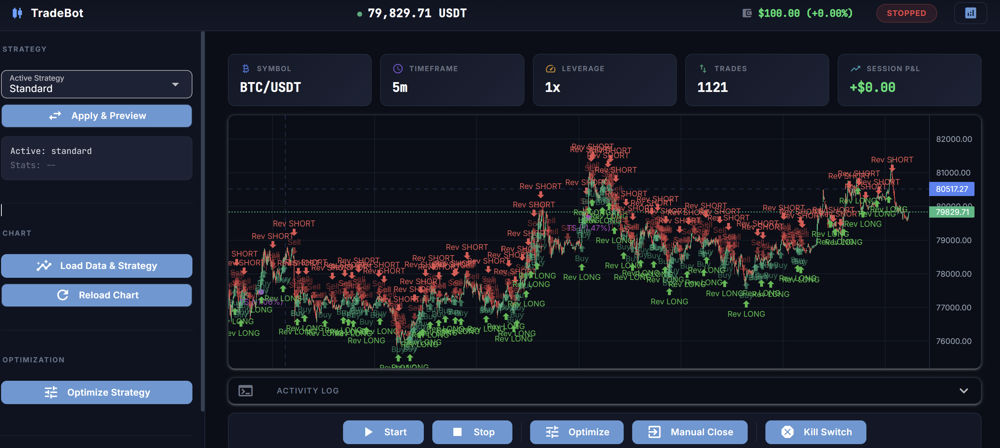

# Crypto Strategy Backtester

A backtesting and parameter-optimization framework for crypto trading
strategies, with a native C++ engine and a real-time web dashboard. Strategies
are defined as JSON rule sets rather than code, so new ones can be added,
compared and tuned without touching Python.

**This is a research tool, not a trading bot — it has no order-execution code
and cannot place trades.** That's a deliberate boundary, not an omission; see
[Scope](#scope).



---

## What it does

Pull OHLCV history from an exchange, run a strategy over it, and answer the
question *was that any good?* — against a buy-and-hold baseline, on data the
optimizer never saw.

- **Backtest** a JSON-defined strategy over ~15k bars, with trade markers
  rendered on an interactive candlestick chart
- **Optimize** its parameters with particle swarm optimization, validated
  walk-forward so results aren't just curve-fitting
- **Compare** strategies head to head, ranked by risk-adjusted return
- **Watch** it run forward on live data in a paper account

KNN Lorentzian classification ships as the reference strategy — it's the worked
example that exercises the framework, not the point of it.

## The strategy system

A strategy is a JSON file describing entry and exit rules over named
indicators. Four ship in `strategies/repository/`:

```jsonc
// strategies/repository/regime_rider.json — abridged
{
  "strategy_name": "Regime Rider",
  "entry_rules": {
    "long": [{ "op": "and", "rules": [
      { "type": "knn_signal", "value": 1,
        "desc": "AI Prediction Bullish" },
      { "type": "compare", "left": "adx", "op": ">", "right": "adx_threshold",
        "desc": "[Regime] Strong Trend" },
      { "type": "compare", "left": "ema_fast", "op": ">", "right": "ema_slow",
        "desc": "[Regime] Uptrend Confirmed" },

      // toggle-gated: the optimizer can switch this filter off entirely
      { "type": "condition", "if": "use_adx_filter", "then": [
          { "type": "compare", "left": "adx", "op": ">", "right": "adx_threshold" }
      ]}
    ]}]
  }
}
```

Rule types are `knn_signal`, `compare` (including `cross_over` / `cross_under`),
and `condition` — a toggle-gated group, which lets the optimizer switch whole
filters on and off as if they were parameters.

The same JSON drives the Python evaluator and the C++ one, so a strategy behaves
identically whether or not the native engine is built. Indicators are resolved
by name through a factory, so adding an indicator doesn't require touching the
rule engine.

Strategies are identified by filename stem and resolve to a class automatically
— dropping a new `.json` into the repository is the entire process for adding
one.

## The C++ engine

The expensive parts are a pybind11 extension (`cpp_extension/`, ~2.7k lines)
compiled with `/O2 /std:c++17 /openmp`:

| | |
|---|---|
| `FastKNN` | KNN with Lorentzian distance, OpenMP-parallel |
| `fast_backtest` | vectorized backtest with partial exits, trailing stops, fee modelling |
| `optimize_pso` | particle swarm over the parameter space |
| `optimize_generic` | exhaustive grid search |
| `IndicatorFactory` / `SignalEvaluator` | JSON rules evaluated natively |

A grid search re-runs the full indicator and signal pipeline for every
combination, which is where the time goes — hence native code.

**The engine is optional.** Every call site falls back to Python (sklearn for
KNN, a pure-Python backtester), so the project runs without a compiler.
`tests/test_parity.py` pins the two implementations to identical results, which
is what makes the fallback trustworthy rather than merely present.

## Optimization & validation

Optimization is easy to fool, so most of the work here is in not fooling
yourself:

- **Walk-forward validation** — parameters are discovered on 70% of the window
  and scored on the 30% the optimizer never saw. A rolling-window mode repeats
  this across the series and reports how many windows stayed profitable.
- **Plateau scoring** — a parameter set is re-scored as `0.7 × own + 0.3 ×
  neighbours`, so an isolated spike loses to a broad, stable region. Sharp
  optima are usually overfitting.
- **Constraints** — results are rejected outright below a minimum trade count or
  above a maximum drawdown, which kills the "three lucky trades" optimum.
- **Benchmarks** — every run is reported against buy-and-hold and a risk-free
  proxy, with Sortino, Calmar, profit factor and alpha. A strategy that
  underperforms holding the asset is a losing strategy no matter how green the
  equity curve looks.

Leverage was deliberately removed from the search space: it inflates the
fitness score without improving the signal, so the optimizer just turns it up.

## Running it

```bash
pip install -r requirements.txt
python main.py run
```

Opens the dashboard at `http://localhost:8088`. **No API keys required** — only
public market-data endpoints are used.

```bash
python main.py optimize                      # optimize the active strategy
python main.py optimize --multi              # rank every strategy in the repository
python main.py optimize --strategy simple    # a specific one
python main.py optimize --timeframe 15m
```

### Optional: build the native engine

Roughly an order of magnitude faster, and required for the risk-adjusted
metrics (Sortino, Calmar, profit factor). Needs MSVC 2022 on Windows.

```bash
python setup.py build_ext --inplace
```

### Tests

```bash
python -m pytest tests/ -q
```

The full suite takes ~8 minutes, most of it PSO. Four modules are skipped
without the native build.

## Scope

Deliberate boundaries, so the results mean what they say:

- **No live trading.** There is no order-execution code anywhere — the exchange
  client is read-only. A design for adding it exists in
  [ADR-002](docs/decisions/ADR-002-live-execution.md), scoped to testnet.
- **1x leverage.** The configured venue is spot-only, so leveraged backtests
  would report returns the project could never reproduce
  ([ADR-003](docs/decisions/ADR-003-leverage-fixed-at-1x.md)).
- **Simulated fills.** Backtests assume complete fills at the candle close with
  a flat fee. No slippage, no partial fills, no order-book depth — so results
  are optimistic, and more so on thin markets.
- **Session-only optimization.** Tuned parameters live in memory and are not
  persisted between runs.

## Engineering notes

The project started with full UML written up front, then drifted as the code
moved. Auditing every diagram in `docs/images/` against the source turned up
**two live bugs the documentation had been hiding**: a strategy hot-swap that
only reached half the system, and two of four shipped strategies being
unreachable because two lookup tables disagreed on what a strategy's name was.

That changed how docs are handled here:

- **[Decision records](docs/decisions/)** — dated, append-only ADRs. A dated
  record of what was decided and why stays true; a present-tense description of
  current structure rots.
- **[Generated diagrams](docs/generated/)** — class and module graphs built from
  the AST by `tools/gen_docs.py`. The hand-drawn class diagram was ~50% wrong
  within six months; nothing hand-maintained replaced it.
- **Status headers** — docs describing things that were never built now say so,
  instead of implying the system has a database and a live trading path.

## Project layout

```
main.py                  entry point → CLI
interface/cli.py         run · optimize · dashboard
core/
  trade_state.py         position, balance, ordered risk cascade
  trader.py              paper-trading loop + stateless analysis engine
  backtester.py          backtest + chart marker generation
  optimizer.py           PSO / grid orchestration, walk-forward
analysis/                indicators, JSON rule evaluator
strategies/              BaseStrategy + Lorentzian + JSON executor
  repository/*.json      the shipped strategies
cpp_extension/           pybind11 native engine
gui/                     NiceGUI dashboard
config/                  trading params + system settings
tools/gen_docs.py        regenerates docs/generated/
```

## Documentation

| | |
|---|---|
| [Decision records](docs/decisions/) | why things are the way they are |
| [Configuration](docs/CONFIGURATION.md) | every parameter and its default |
| [Generated diagrams](docs/generated/) | class + module graphs from source |
| [Architecture](docs/ARCHITECTURE.md) | system design |
| [C++ engine](docs/cpp/) | native module internals |
| [Dashboard](docs/dashboard/) | UI architecture, chart marking logic |

## Credits

KNN Lorentzian classification is based on
[jdehorty's TradingView indicator](https://www.tradingview.com/script/WhBzgfDu-Machine-Learning-Lorentzian-Classification/).

## License

Personal and educational use. Not financial advice, and not a recommendation to
trade anything.
