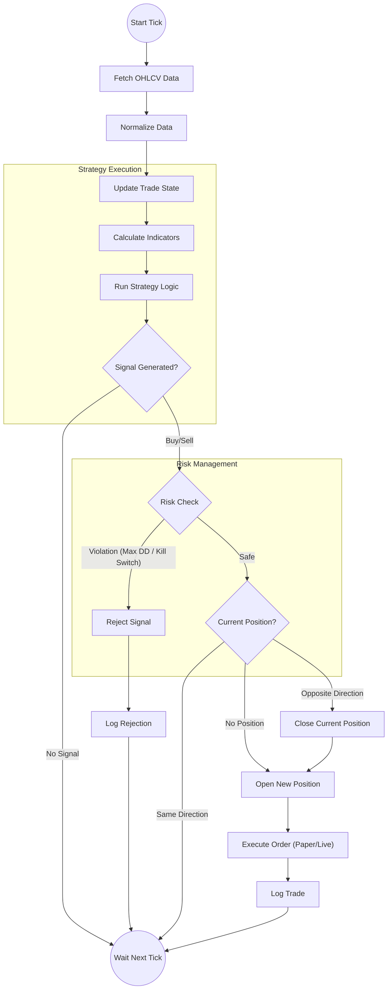
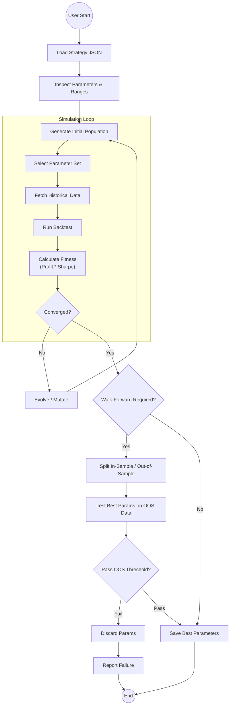
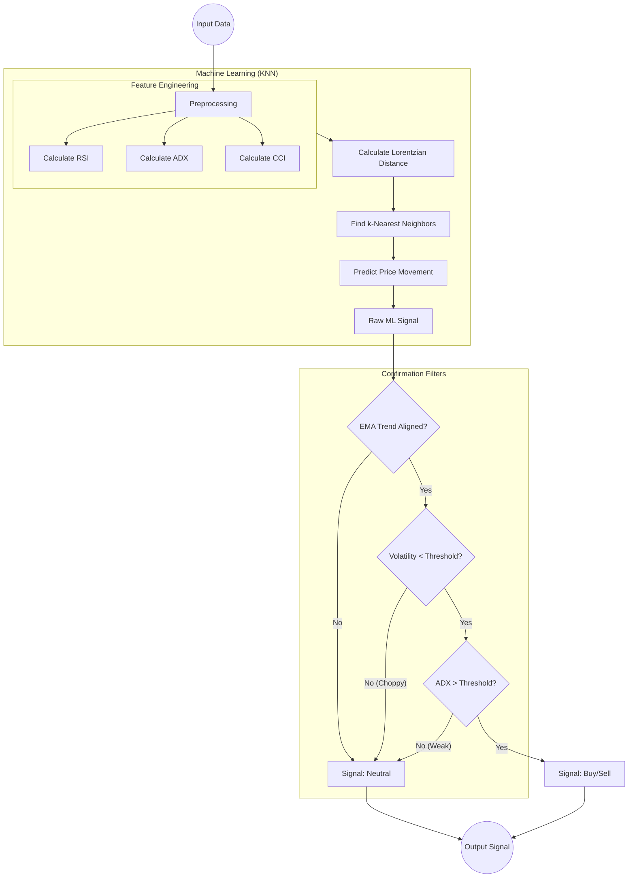

# Activity Diagrams

This document details the key workflows of the **Modular Algorithmic Trading Platform**.

## 1. Core Trading Loop
This diagram illustrates the main execution cycle that occurs on every "Heartbeat" (Tick/Candle Close). It shows how the Core Engine interacts with the Pluggable Strategy and Risk Management layers.

## 2. Optimization Workflow
This diagram depicts the Universal Optimization process, highlighting how the system adapts to different strategies and optimizes parameters using a genetic or grid-based approach.

## 3. Signal Evaluation Logic (Example: Lorentzian)
This diagram details the internal logic of a sophisticated strategy (like Lorentzian) to show how multiple components (KNN, Filters, Thresholds) combine to produce a final signal.

