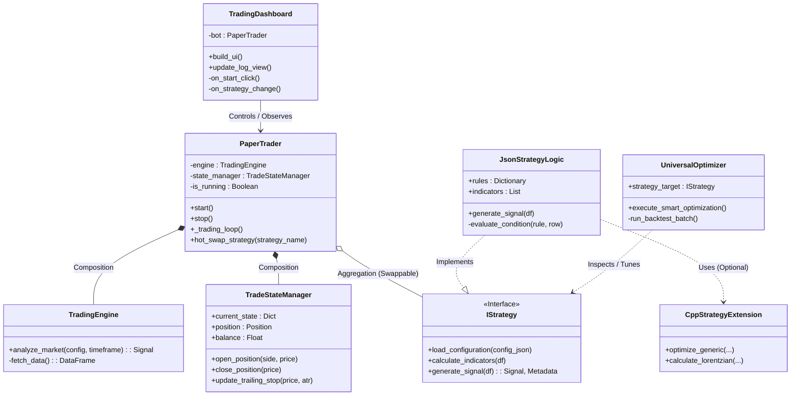

# Class Diagram

This document illustrates the static structure and relationships between the main classes of the **Modular Algorithmic Trading Platform**.

## Class Descriptions

1.  **PaperTrader**: The distinct "Controller" class. It owns the main loop, manages the lifecycle, and coordinates between the Engine (Data/Calc) and the State Manager (Account/Risk).
2.  **TradeStateManager**: Handles the accounting. It tracks balance, positions, and enforces risk rules like Trailing Stops. It acts as the "source of truth" for the dashboard.
3.  **IStrategy (Interface)**: The contract that all strategies must fulfill. While `JsonStrategyLogic` is the primary implementation, this abstraction allows for future Python-class-based strategies.
4.  **JsonStrategyLogic**: The concrete implementation that parses `.json` files. It converts JSON rules into executable boolean logic (e.g., "RSI < 30").
5.  **CppStrategyExtension**: Represents the high-performance C++ module (`cpp_engine`) used for intensive tasks like KNN or massive optimization loops.
