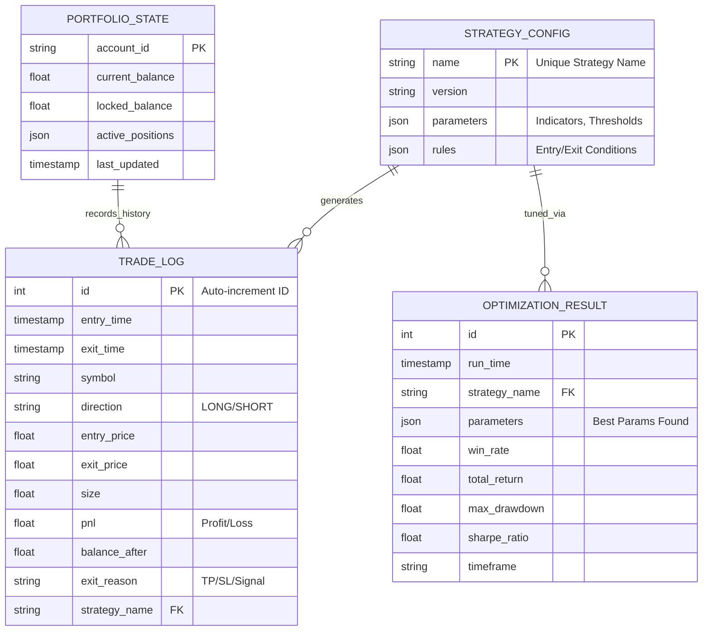

# Entity Relationship Diagram (ERD)

This document visualizes the data entities and their relationships within the **Modular Algorithmic Trading Platform**. Since the system currently uses CSV files and JSON configuration rather than a relational database, this diagram represents the *logical* data model.

## Data Entity Descriptions

1.  **STRATEGY_CONFIG**: Represents the JSON files located in `strategies/`. It is the blueprint for trading logic.
    *   *Storage*: `strategies/*.json`
2.  **TRADE_LOG**: The historical record of all executed trades. This is the primary source for performance analysis.
    *   *Storage*: `trades.csv` (and potentially `logs/app.log` for unstructured data).
3.  **OPTIMIZATION_RESULT**: Stores the outcomes of genetic algorithm runs, allowing the user to pick the best customization for a strategy.
    *   *Storage*: `optimizations.csv`
4.  **PORTFOLIO_STATE**: The live snapshot of the user's account. While currently transient (in-memory `TradeStateManager`), in a production database it would be a persistent table.
    *   *Storage*: In-Memory (runtime).
