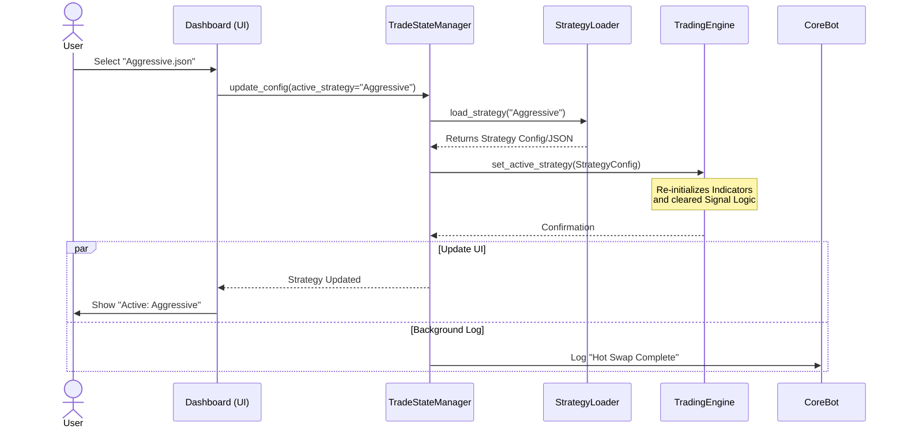
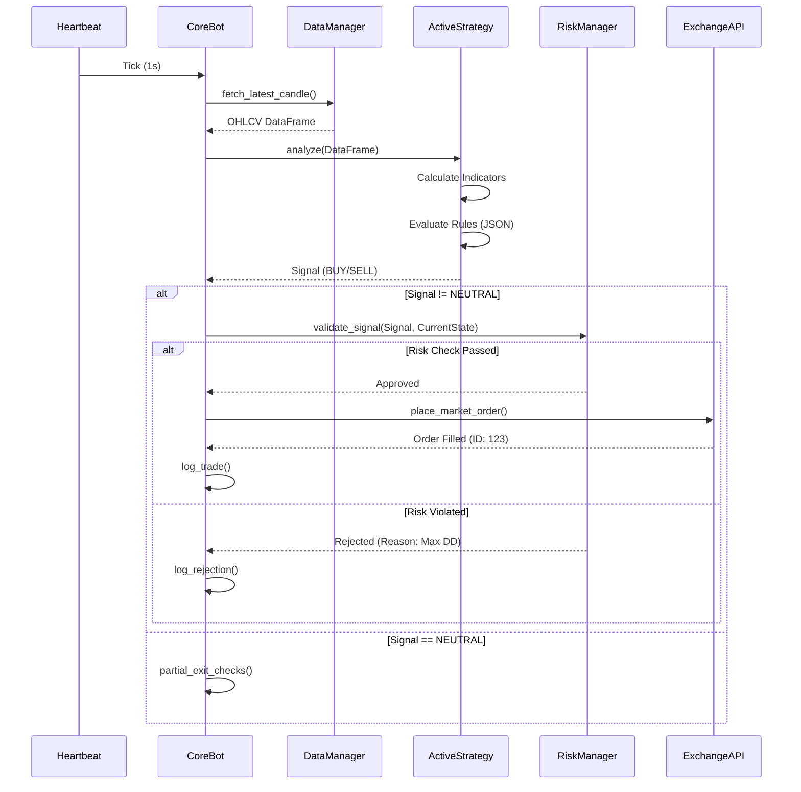
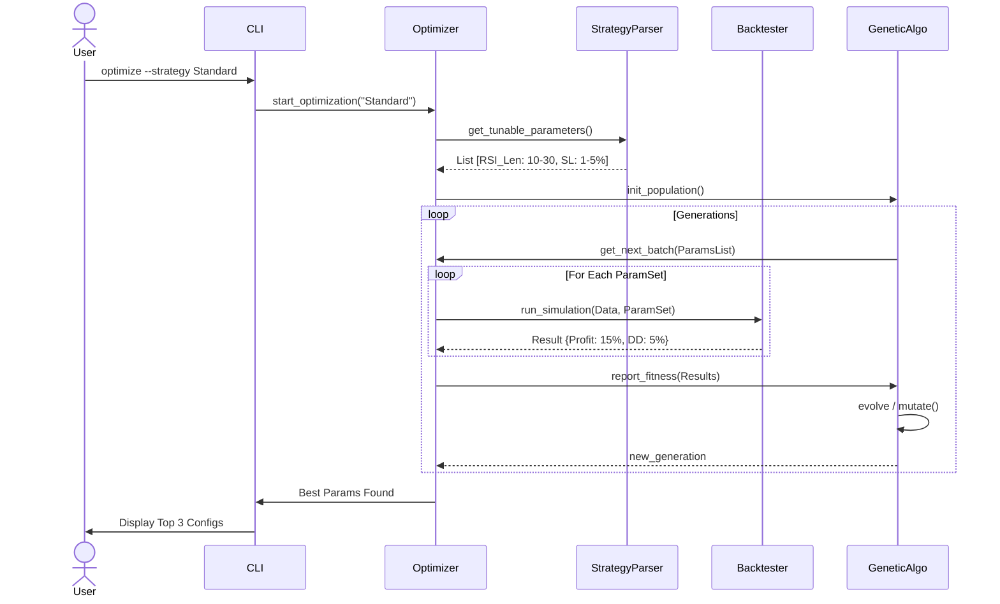

# Sequence Diagrams

This document details the complex interactions between system components.

## 1. Strategy Hot-Swapping
This diagram shows the sequence of events when a user changes the active strategy from the Dashboard, ensuring the live bot updates without restarting.

## 2. Live Trade Execution
The critical path from receiving a market tick to executing an order.

## 3. Optimization Loop
How the `UniversalOptimizer` interacts with the `Backtester` to find the best parameters.

