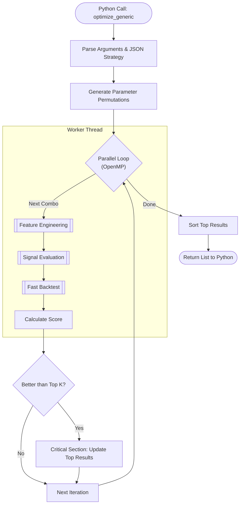
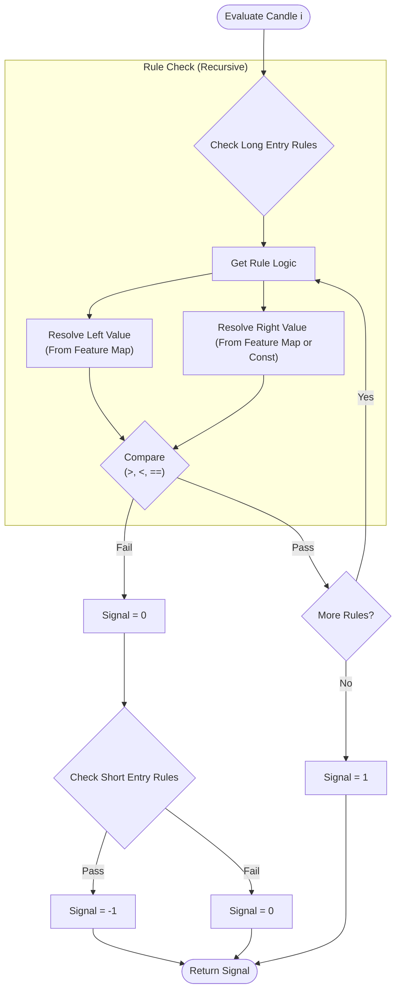
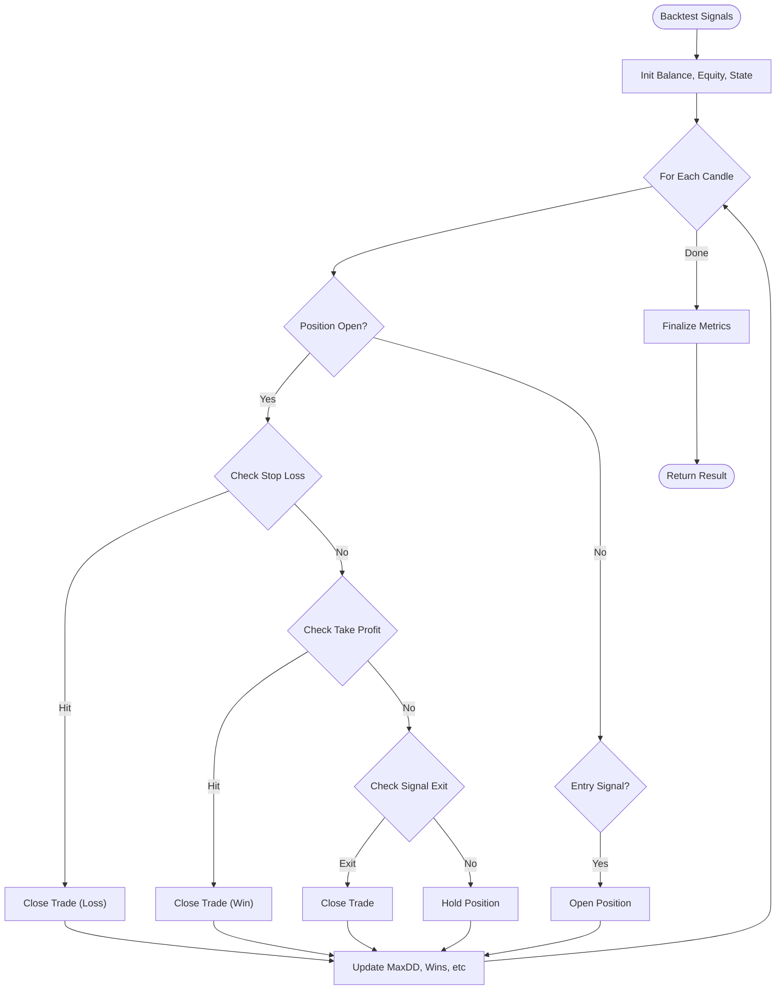

# C++ Engine Activity Diagrams

## 1. Top-Level Optimization Flow (`optimize_generic`)

This diagram illustrates the high-level control flow when Python calls the C++ optimizer.



## 2. Feature Engineering

This section details how the optimizer dynamically computes indicators based on `strategies.json` definitions.

```mermaid
flowchart TD
    Start([Start Feature Gen]) --> LoadConf[Load Strategy Indicator Config]
    LoadConf --> Loop{For Each Indicator}
    
    Loop -->|Get Type & Params| Factory[Indicator Factory <br/> (Compute by Type)]
    Factory -->|Compute| Store[Store in Feature Map]
    
    Store --> Loop
    Loop -- Done --> ML{Has ML Model?}
    
    ML -- Yes --> TrainPredict[Train & Predict Model]
    ML -- No --> Return
    TrainPredict --> Return([Ready for Evaluator])
```

## 3. Signal Evaluation (Actually Generic)

The `SignalEvaluator` is already well-designed and generic.



## 4. Fast Backtesting

The simulated execution engine (stateless).


