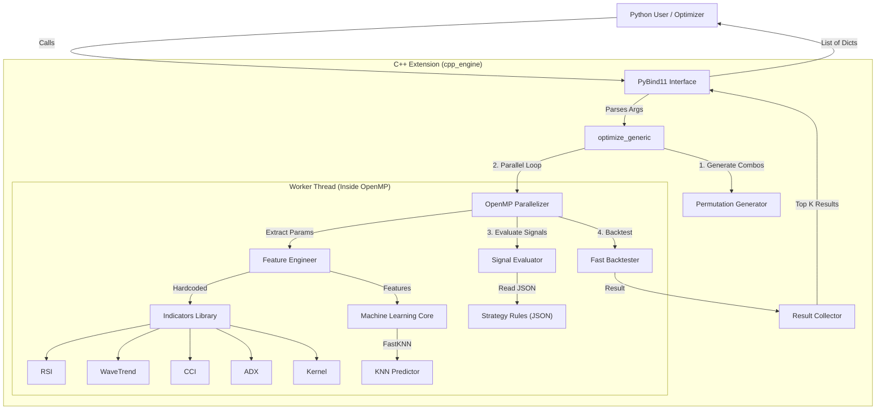

# C++ Execution Engine Architecture

## Overview
The C++ Engine (`cpp_engine`) is a high-performance extension designed to accelerate the **Optimization** and **Backtesting** phases. It communicates with Python via `pybind11`.

Currently, it follows a **Hybrid Architecture**:
- **Interface:** Generic (Accepts arbitrary lists of parameters).
- **Implementation:** Specialized (Hardcoded to calculate Lorentzian features: RSI, ADX, CCI, WaveTrend, KNN).

## System Context Diagram

## Component Breakdown

### 1. PyBind11 Interface (`bindings.cpp`)
- Exposes `optimize_generic` to Python.
- Converts Python lists/dicts to C++ `std::vector` and maps.

### 2. Optimization Logic (`optimizer.cpp`)
- **Permutation Generator**: Creates a grid of all possible parameter combinations.
- **Hybrid Generic/Specialized Logic**:
    - *Generic*: Iterates over arbitrary parameter combos.
    - *Specialized*: explicitly looks for "rsi_length", "adx_length", etc., and calls specific indicator functions. **This is the main bottleneck for generalization.**

### 3. Indicators Library (`indicators.cpp`)
- Stateless collection of math functions (`rsi`, `ema`, `atr`, `rq_kernel`).
- Optimized for vector operations.

### 4. Machine Learning Core (`knn.cpp`)
- `FastKNN`: A custom, simplified K-Nearest Neighbors implementation optimized for 4D feature space (RSI, WT, CCI, ADX).

### 5. Signal Evaluator (`signal_evaluator.cpp`)
- Parses `strategies.json` to determine entry/exit logic.
- **Generic**: Can evaluate complex logical trees (e.g., `(RSI < 30) AND (Close > EMA)`).

### 6. Fast Backtester (`backtester.cpp`)
- Simulates trading (Entry, Exit, Stop Loss, Take Profit) on the signal array.
- Calculates metrics (Net Profit, MDD, Win Rate) in a single pass.

## Current Limitation
While the **Signal Evaluator** is generic, the **Feature Engineering** step is hardcoded.
- **Current:** `FeatureEng` -> manually calls `indicators::rsi`, `indicators::adx`...
- **Target (True Generic):** `FeatureEng` -> iterates over `ActiveStrategy.required_indicators` and dynamically calls `indicators::compute(type, args)`.
