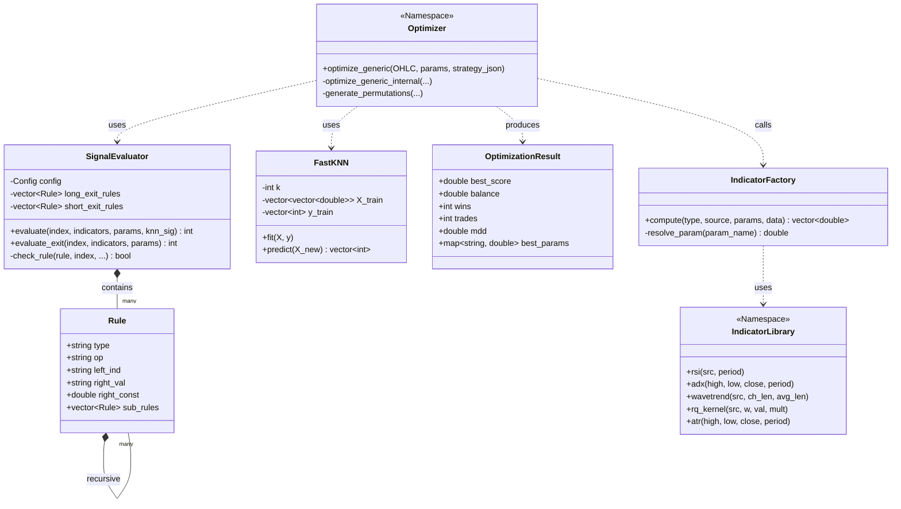

# C++ Engine Class Diagram

This diagram represents the key classes and structures in the C++ extension.

## Architecture

```mermaid
classDiagram
    class SignalEvaluator {
        -Config config
        -vector~Rule~ long_exit_rules
        -vector~Rule~ short_exit_rules
        +evaluate(index, indicators, params, knn_sig) int
        +evaluate_exit(index, indicators, params) int
        -check_rule(rule, index, ...) bool
    }

    class Rule {
        +string type
        +string op
        +string left_ind
        +string right_val
        +double right_const
        +vector~Rule~ sub_rules
    }

    class FastKNN {
        -int k
        -vector~vector~double~~ X_train
        -vector~int~ y_train
        +fit(X, y)
        +predict(X_new) vector~int~
    }

    class OptimizationResult {
        +double best_score
        +double balance
        +int wins
        +int trades
        +double mdd
        +map~string, double~ best_params
    }

    class IndicatorFactory {
        +compute(type, source, params, data) vector~double~
        -resolve_param(param_name) double
    }

    class IndicatorLibrary {
        <<Namespace>>
        +rsi(src, period)
        +adx(high, low, close, period)
        +wavetrend(src, ch_len, avg_len)
        +rq_kernel(src, w, val, mult)
        +atr(high, low, close, period)
    }

    class Optimizer {
        <<Namespace>>
        +optimize_generic(OHLC, params, strategy_json)
        -optimize_generic_internal(...)
        -generate_permutations(...)
    }

    %% Relationships
    SignalEvaluator *-- "many" Rule : contains
    Rule *-- "many" Rule : recursive
    Optimizer ..> SignalEvaluator : uses
    Optimizer ..> FastKNN : uses
    Optimizer ..> IndicatorFactory : calls
    IndicatorFactory ..> IndicatorLibrary : uses
    Optimizer ..> OptimizationResult : produces
```
