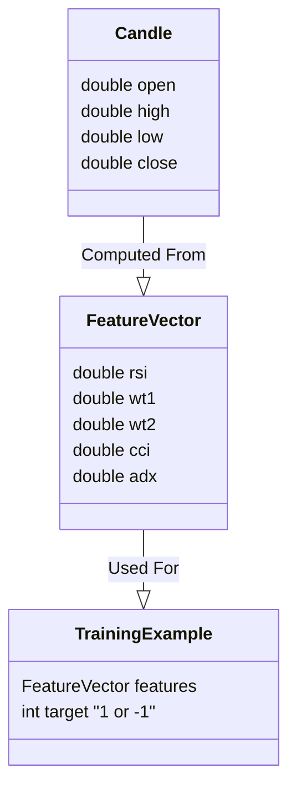

# C++ Engine Data Structures (ERD)

Since the C++ Engine is stateless (no database), this ERD represents the **Configuration Data Model** and how the `strategies.json` maps to internal structures.

## Strategy Configuration Model

```mermaid
erDiagram
    STRATEGY_JSON ||--|{ ENTRY_RULES : contains
    STRATEGY_JSON ||--|{ EXIT_RULES : contains
    STRATEGY_JSON ||--|{ INDICATOR_PARAMS : defines

    ENTRY_RULES ||--|{ RULE_NODE : consists_of
    EXIT_RULES ||--|{ RULE_NODE : consists_of
    
    RULE_NODE ||--o{ SUB_RULES : nests("condition")
    
    OPTIMIZATION_RESULT ||--|{ PARAMETER : has_many
    
    %% Entity Definitions
    STRATEGY_JSON {
        string name
        string description
        string version
    }

    RULE_NODE {
        string type "compare|condition|knn_signal"
        string left "rsi|adx|close..."
        string op ">|<|==|and"
        string right "value|param_name"
    }

    INDICATOR_PARAMS {
        string name
        string type "dynamic|static"
        int default
        int step
    }

    OPTIMIZATION_RESULT {
        double balance
        double score
        double win_rate
        double max_drawdown
    }

    PARAMETER {
        string name
        double optimized_value
    }
```

## Data Flow Objects


