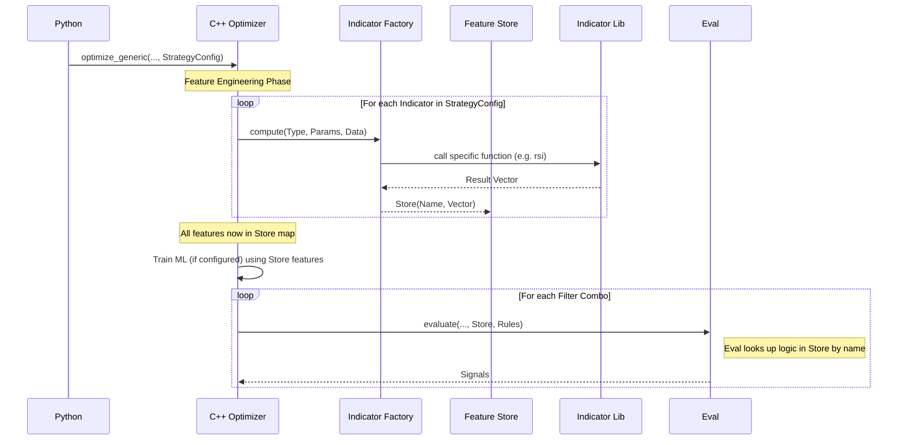

# C++ Engine Sequence Diagrams

## 1. Generic Optimization Loop

This shows how the Optimizer dynamically requests features from the Factory based on the Strategy Config, effectively decoupling the engine from specific indicators.

```mermaid
sequenceDiagram
    participant Py as Python
    participant Opt as C++ Optimizer
    participant Factory as Indicator Factory
    participant IndLib as Indicator Lib
    participant Store as Feature Store
    participant Eval as Signal Evaluator

    Py->>Opt: optimize_generic(..., StrategyConfig)
    
    Note over Opt: Feature Engineering Phase
    
    loop For each Indicator in StrategyConfig
        Opt->>Factory: compute(Type, Params, Data)
        Factory->>IndLib: call specific function (e.g. rsi)
        IndLib-->>Factory: Result Vector
        Factory-->>Store: Store(Name, Vector)
    end
    
    Note over Opt: All features now in Store map
    
    Opt->>Opt: Train ML (if configured) using Store features
    
    loop For each Filter Combo
        Opt->>Eval: evaluate(..., Store, Rules)
        Note right of Eval: Eval looks up logic in Store by name
        Eval-->>Opt: Signals
    end
    
    Opt-->>Py: Return Top K Results
```

## 2. Proposed Generic Feature Engineering

This shows the target state where the Optimizer doesn't know about specific indicators (RSI, etc.) but asks a Factory to compute them based on the Strategy Config.


