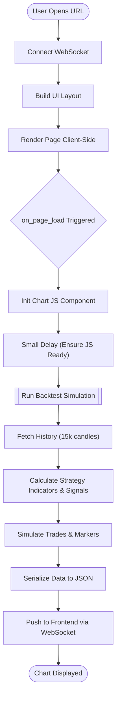
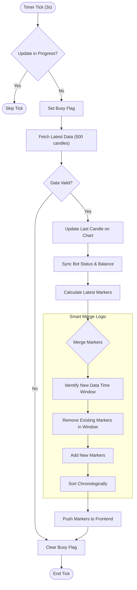
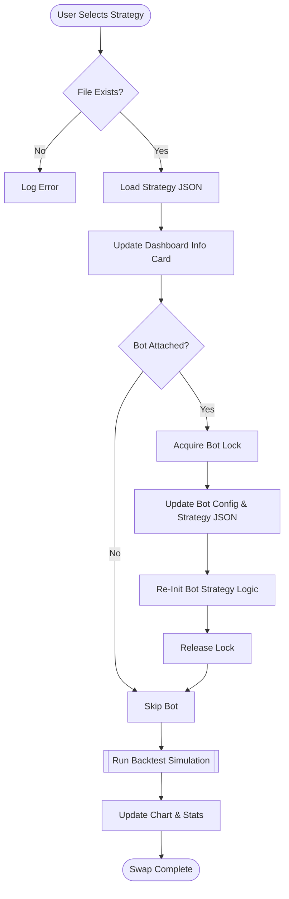
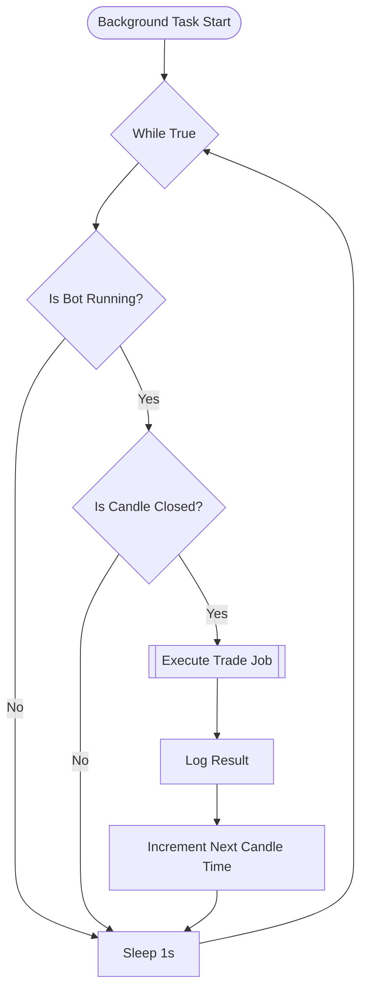

# Dashboard Activity Diagrams

This document visualizes the key workflows within the **Trading Dashboard** using Mermaid activity diagrams.

## 1. Dashboard Initialization & Load
This flow occurs when a user opens the dashboard in their browser.

## 2. Live Chart Update Loop
The dashboard runs a timer (default 3s) to keep the chart in sync with the market and the bot's execution.

## 3. Strategy Hot-Swap
This flow is triggered when the user selects a different strategy from the dropdown menu.

## 4. Bot Execution Loop (Background)
The dashboard maintains a background loop to drive the `PaperTrader` or `LiveTrader` even if no UI client is connected.

