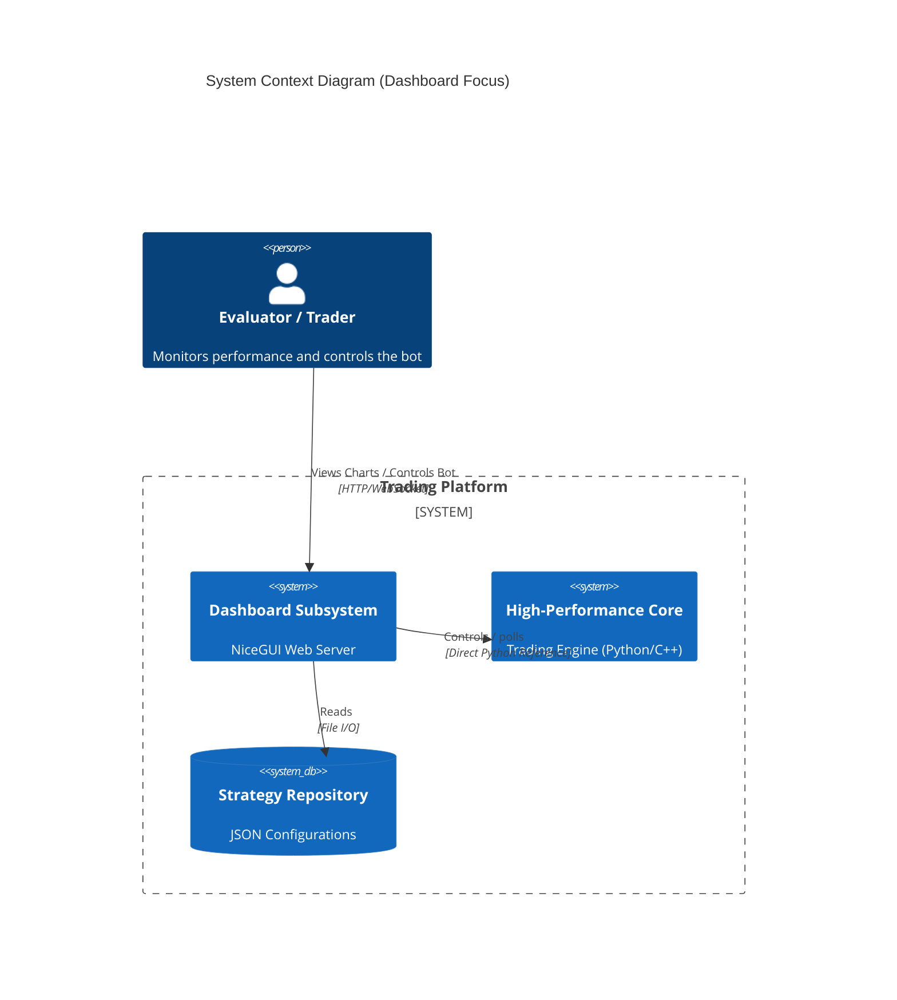

# Dashboard Architecture

## 1. System Context

The **Dashboard** is a subsystem of the **Modular Algorithmic Trading Platform**. It serves as the primary presentation layer and control interface for the otherwise headless **Core Execution Engine**.

Reference: [System Architecture](../ARCHITECTURE.md)



## 2. Component Architecture

The Dashboard is built using **NiceGUI**, which acts as a wrapper around **FastAPI** (backend) and **Vue.js** (frontend), synchronizing state via WebSockets.

| Component | Responsibility | Tech Stack |
| :--- | :--- | :--- |
| **Server** | Hosts the UI, manages client connections, and runs the background loop. | Python, Uvicorn, FastAPI |
| **UI Builder** | Constructs the DOM tree and binds events to Python handlers. | NiceGUI |
| **Chart Controller** | Renders interactive financial charts and visualizes markers. | JavaScript (Custom), Lightweight Charts |
| **Data Bridge** | Fetches OHLCV data, runs backtests, and serializes results for the UI. | Pandas, Asyncio |
| **Log Bridge** | Intercepts `sys.stdout`/`stderr` and broadcasts to connected clients. | Python `io` streams |

### 2.1 Interaction Diagram

```mermaid
graph TD
    subgraph "Frontend (Browser)"
        LightweightCharts[Lightweight Charts Lib]
        VueComponents[NiceGUI Components]
    end

    subgraph "Backend (Python Process)"
        subgraph "Dashboard Layer"
            Endpoint[Index Page Route]
            ChartElem[ChartElement (Python Wrapper)]
            StreamRedir[Stream Redirector]
            BackgroundLoop[Async Background Loop]
        end

        subgraph "Core Integration"
            BotInstance[PaperTrader / LiveTrader]
            TradeState[TradeStateManager]
        end
    end

    %% Flows
    VueComponents <-->|WebSocket| Endpoint
    Endpoint -->|Builds| ChartElem
    ChartElem -->|JS Calls| LightweightCharts
    
    BotInstance -->|Logs| StreamRedir
    StreamRedir -->|Push| VueComponents
    
    BackgroundLoop -->|Polls| TradeState
    BackgroundLoop -->|Updates| ChartElem
    
    Endpoint -->|Direct Control| BotInstance
```

## 3. Data Flow

### 3.1 Initialization & Backtest (Pull)
1.  **Trigger**: User loads page or changes strategy.
2.  **Fetch**: `fetch_and_cache_data` loads 15k candles from CCXT/CSV.
3.  **Process**:
    *   Current Strategy Config is applied.
    *   `analysis.signals.generate_signals` computes indicators & signals.
    *   `core.backtester.run_backtest_with_markers` simulates execution.
4.  **Render**: Data is serialized to JSON and sent to `LightweightCharts`.

### 3.2 Live Updates (Push)
1.  **Loop**: `update_chart_loop` runs every 3 seconds (configurable).
2.  **Fetch**: Fetches the latest 500 candles.
3.  **Compute**: Re-runs signal generation on the latest chunk.
4.  **Smart Merge**:
    *   Identifies the time window of the new chunk.
    *   Replaces markers *only* within that window (clearing "phantom" signals).
    *   Maintains historical markers outside the window.
5.  **Update**: Calls `chart.update_candle()` and `chart.set_markers()`.

## 4. Design Decisions

### 4.1 Direct Object Reference vs. API
*   **Decision**: The Dashboard holds a direct reference to the `PaperTrader` instance (`self.bot`).
*   **Rationale**: Simplifies architecture for a local desktop app. No complex REST API or message queue is needed between UI and Engine.
*   **Implication**: The UI and Bot run in the same process/memory space. `asyncio` is crucial to prevent UI blocking.

### 4.2 Stream Redirection
*   **Decision**: Console logs (`print`) are intercepted.
*   **Rationale**: Ensures that critical engine logs (execution errors, trade fills) are visible in the web UI without requiring a separate logging infrastructure.

### 4.3 Client-Side Rendering with Server-Side Logic
*   **Decision**: Lightweight Charts renders in browser, but all logic (signals, markers) is calculated in Python.
*   **Rationale**: Keeps proprietary/complex strategy logic secure and centralized in Python. The browser is purely a "dumb" renderer.
