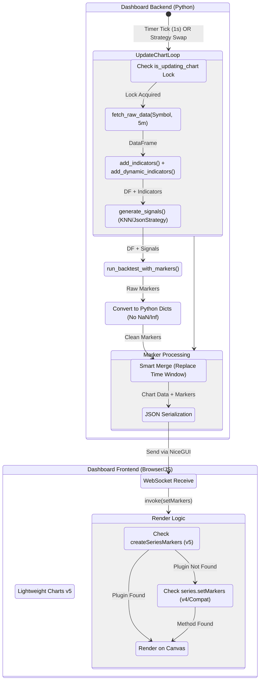

# Chart Marker Logic - Activity Diagram

This diagram illustrates the end-to-end process of generating and rendering trade markers (Buy/Sell signals) on the Dashboard Chart.

## Key Components

1.  **Backtest Simulation (`run_backtest_with_markers`)**:
    *   Replays the strategy logic over the fetched data.
    *   Generates `Entry` (LONG/SHORT) and `Exit` (TP/SL/TS/BE) events.
    *   Outputs a list of marker dictionaries: `{ time, position, color, shape, text }`.

2.  **Smart Merge Logic**:
    *   To prevent flickering or "phantom markers" during live updates, the dashboard replaces markers *only* within the simulation time window.
    *   Markers outside the window (historical) are preserved.

3.  **Frontend Rendering (v5 Migration)**:
    *   The system detects if `LightweightCharts.createSeriesMarkers` (v5 Plugin API) is available.
    *   If not, it falls back to `series.setMarkers` (Legacy API).
