<!-- GENERATED FILE — DO NOT EDIT BY HAND -->
<!-- Regenerate with: python tools/gen_docs.py -->

*Generated 2026-08-26 from the source tree. Any hand edit will be overwritten.*

# Class Diagram (generated)

```mermaid
classDiagram
    class SignalEvaluator {
    +entry_rules
    +config
    +evaluate(df, params)
    +evaluate_exit(df, params)
    }
    class CsvLogger {
    +filename
    +fieldnames
    +log(data)
    }
    class OptimizationLogger {
    +log_optimization(score, balance, win_rate, mdd, params)
    }
    class TradeLogger {
    +log_trade(event, symbol, side, price, pnl, balance, leverage, config)
    }
    class QueueLogger {
    +queue
    +terminal
    +write(message)
    +flush()
    }
    class TradeStateManager {
    +config
    +logger
    +logic
    +lock
    +balance
    +position
    +avg_entry
    +entry_leverage
    +entry_atr
    +trade_history
    +wins
    +trades
    +18 more...
    }
    class PaperTrader {
    +trade_logger
    +opt_logger
    +state
    +is_optimizing
    +engine
    +lock
    +update_config(new_config)
    +run_optimization_thread()
    +monitor_position()
    +trade_job()
    +execute_trade_logic(sig, price, atr, extras)
    +kill_switch()
    +2 more...
    }
    class TradingEngine {
    +analyze_market(config, timeframe, strategy)
    }
    class ChartElement {
    +init_chart(e)
    +set_data(data)
    +update_candle(candle)
    +set_markers(markers)
    }
    class LogElement {
    +push(msg, **kwargs)
    }
    class StreamRedirector {
    +stream
    +callback
    +quiet
    +encoding
    +write(message)
    +flush()
    +isatty()
    +fileno()
    }
    class AppLayout {
    +dashboard
    +build()
    }
    class TradingDashboard {
    +is_running
    +client_connected
    +history_data
    +chart
    +bot
    +active_strategy_path
    +active_strategy_name
    +available_strategies
    +original_stdout
    +original_stderr
    +set_bot(bot)
    +on_page_load()
    +16 more...
    }
    class DebugChart {
    +init_chart(_)
    }
    class UnknownStrategyError {
    
    }
    class BaseStrategy {
    <<abstract>>
    +config
    +calculate_indicators(df)
    +generate_signals(df)
    +get_parameter_ranges()
    +process_signal(state, price, signal, atr, extras)
    +get_pnl(state, price)
    }
    class JsonStrategyLogic {
    +calculate_indicators(df)
    +generate_signals(df)
    +get_parameter_ranges()
    +process_signal(state, price, signal, atr, extras)
    }
    class LorentzianStrategy {
    +calculate_indicators(df)
    +generate_signals(df)
    +get_parameter_ranges()
    +process_signal(state, price, signal, atr, extras)
    }
    BaseStrategy <|-- JsonStrategyLogic
    BaseStrategy <|-- LorentzianStrategy
    CsvLogger <|-- OptimizationLogger
    CsvLogger <|-- TradeLogger
```

## Classes by module

| Module | Class | Bases |
|---|---|---|
| `analysis.signal_evaluator` | `SignalEvaluator` | — |
| `core.logger` | `CsvLogger` | — |
| `core.logger` | `OptimizationLogger` | CsvLogger |
| `core.logger` | `TradeLogger` | CsvLogger |
| `core.queue_logger` | `QueueLogger` | — |
| `core.trade_state` | `TradeStateManager` | — |
| `core.trader` | `PaperTrader` | — |
| `core.trader` | `TradingEngine` | — |
| `gui.components.chart` | `ChartElement` | element |
| `gui.components.console` | `LogElement` | log |
| `gui.components.console` | `StreamRedirector` | — |
| `gui.components.layout` | `AppLayout` | — |
| `gui.dashboard` | `TradingDashboard` | — |
| `gui.debug_chart` | `DebugChart` | element |
| `strategies` | `UnknownStrategyError` | KeyError |
| `strategies.base` | `BaseStrategy` | ABC |
| `strategies.json_strategy` | `JsonStrategyLogic` | BaseStrategy |
| `strategies.lorentzian` | `LorentzianStrategy` | BaseStrategy |
